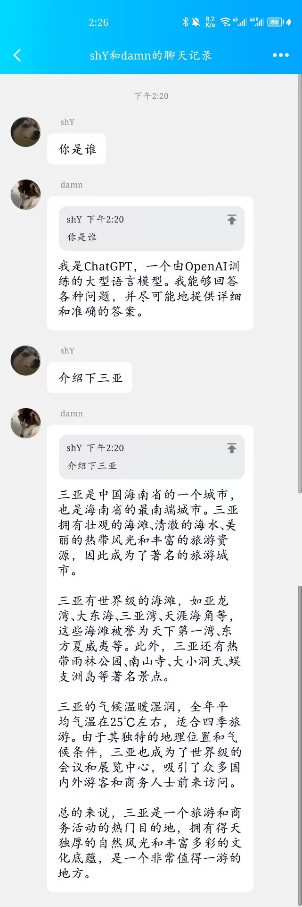
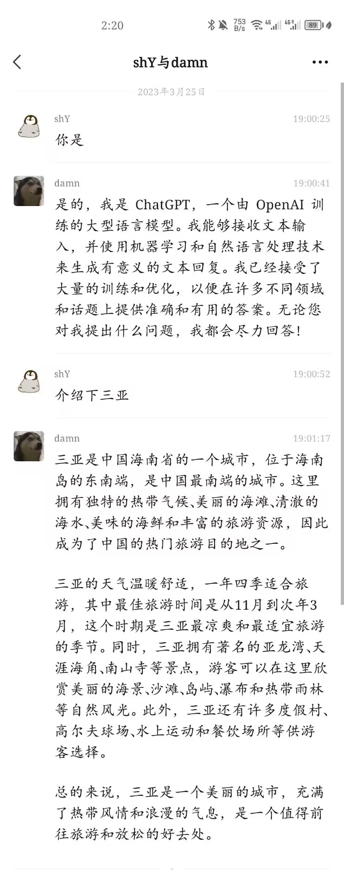

It is build on

[wechat-chatgpt](https://github.com/fuergaosi233/wechat-chatgpt.git)

[chatgpt-mirai-qq-bot](https://github.com/lss233/chatgpt-mirai-qq-bot.git)

# QQ Side
- bot-qq
- socket-client

# Wechat Side
- bot-wechat
- socket-client

# ChatGPT Side
- socket-server

### Snapshots
<!--  -->

QQ          |  Wechat
:-------------------------:|:-------------------------:
   |  
